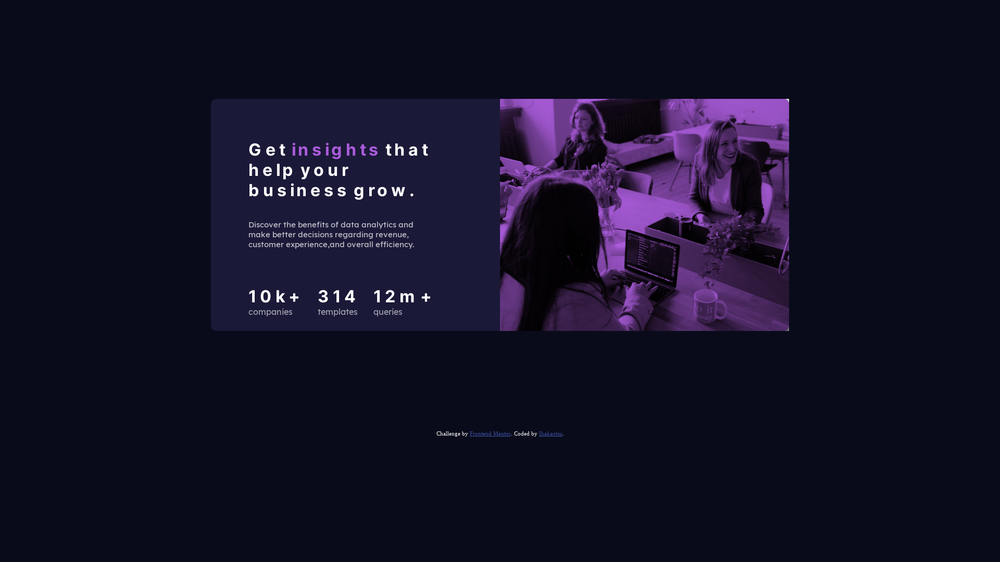
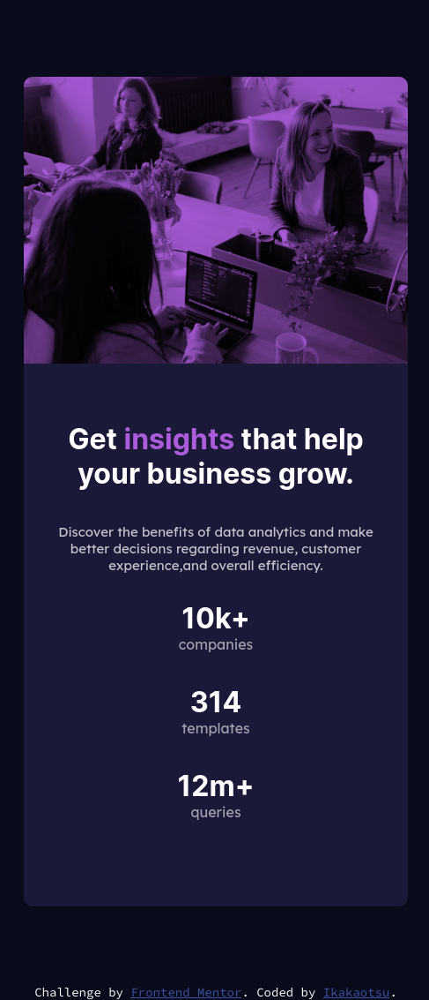

# Frontend Mentor - Stats preview card component solution

This is a solution to the [Stats preview card component challenge on Frontend Mentor](https://www.frontendmentor.io/challenges/stats-preview-card-component-8JqbgoU62). Frontend Mentor challenges help you improve your coding skills by building realistic projects.

## Table of contents

- [Overview](#overview)
  - [The challenge](#the-challenge)
  - [Screenshot](#screenshot)
  - [Links](#links)
- [My process](#my-process)
  - [Built with](#built-with)
  - [What I learned](#what-i-learned)
  - [Useful resources](#useful-resources)
- [Author](#author)

## Overview

### The challenge

Users should be able to:

- View the optimal layout depending on their device's screen size

### Screenshot

### Links

- Solution URL: [Add solution URL here](https://cutt.ly/3mUrDdX)
- Live Site URL: [Add live site URL here](https://ikakaotsu.github.io/frontendmentor/stats-preview-card-component-main/)

## My process

### Built with

- CSS custom properties
  - Colors and Fonts
- Flexbox
- Mobile-first workflow

### What I learned

The use of the HTML <picture> tag, the CSS mix-blend-mode property to mix the content (color) of an element with the backgrond. Practice the use of custom properties as well padding and margins properties.

### Useful resources

- [Mozilla developer Page](https://developer.mozilla.org/es/) - This helped me for search info.

## Author

- Twitter - [@ikakaotsu](https://www.twitter.com/ikakaotsu)
